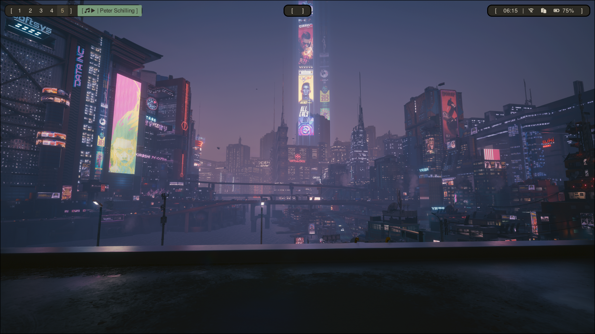

### v1.1



- added hyprland autostart with sddm service 
``` bash
pacman -S sddm
systemd enable sddm
ls /usr/share/wayland-sessions
cat /etc/sddm.conf
```

- configurated hyprlock
``` bash
pacman -S hyprlock
```
Mostly inspired from : 
https://github.com/mahaveergurjar/Hyprlock-Dots

``` bash
chmod +x ~/.config/hyprlock/scripts/*.sh
```
Used with Super + L


Adjustments to the config : 
- Pb with time sync, ran those cmds and it worked : 

``` bash 
timedatectl
timedatectl set-ntp true
sudo timedatectl set-local-rtc 0
sudo hwclock --systohc
```

Installing hyprshot 

---- work in progress// -----

sudo pacman -S --needed git base-devel && git clone https://aur.archlinux.org/yay-bin.git && cd yay-bin && makepkg -si

yay -S sticky-notes


Fixing blurry discord & spotify

Not working if only adding the env var in hyprland.conf 
this one :

``` bash
env = ELECTRON_OZONE_PLATFORM_HINT,wayland
```


It is needed to edit the desktop files of the apps (at least in my case): 

For discord : 

```bash
mkdir -p ~/.local/share/applications
cp /usr/share/applications/discord.desktop ~/.local/share/applications/
nano ~/.local/share/applications/discord.desktop
```


Editing the exec line with 
```bash
 discord --enable-features=WaylandWindowDecorations --ozone-platform-hint=auto 
 ```

This forces Discord to use native Wayland rendering instead of XWayland, fixing blurry rendering on Hyprland.

same with spotify //


pacman -S noto-fonts-emojis
